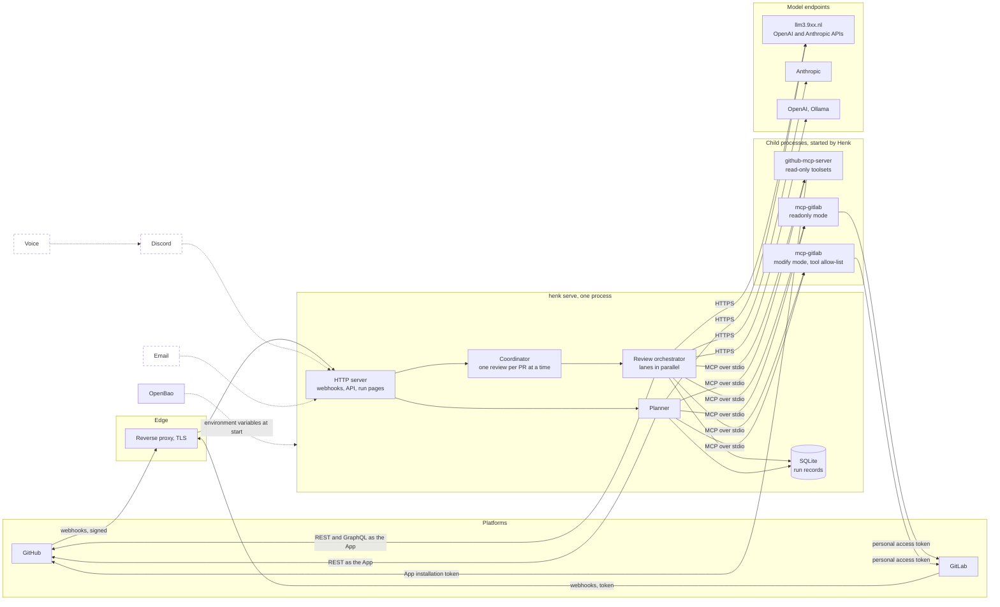
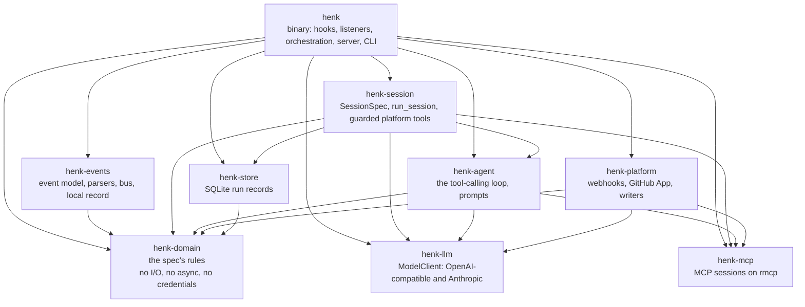
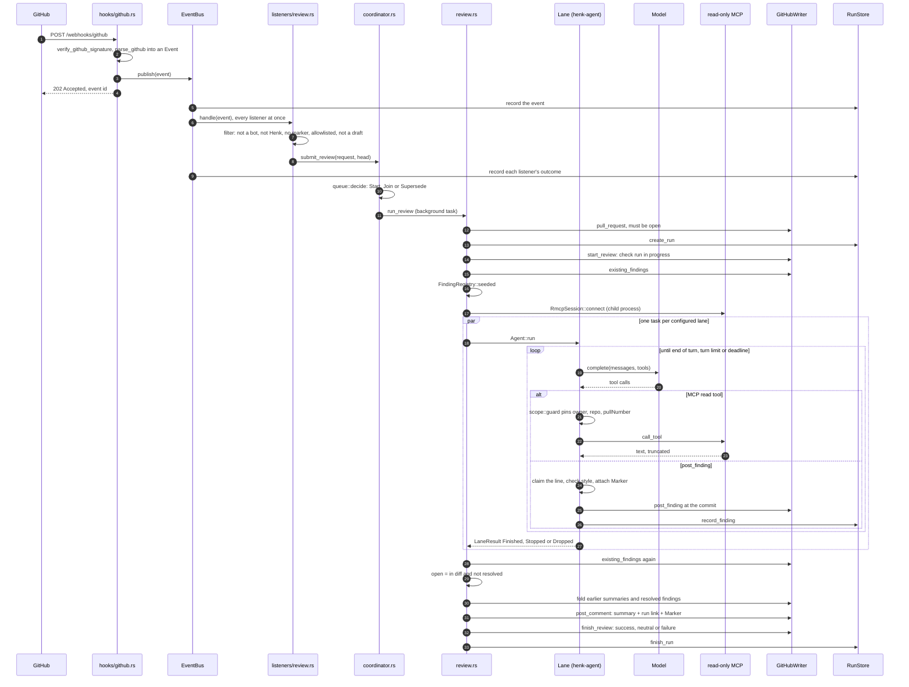
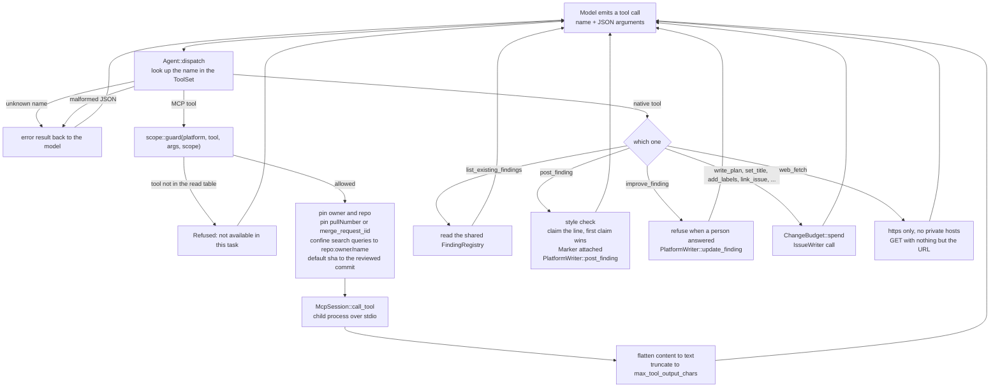
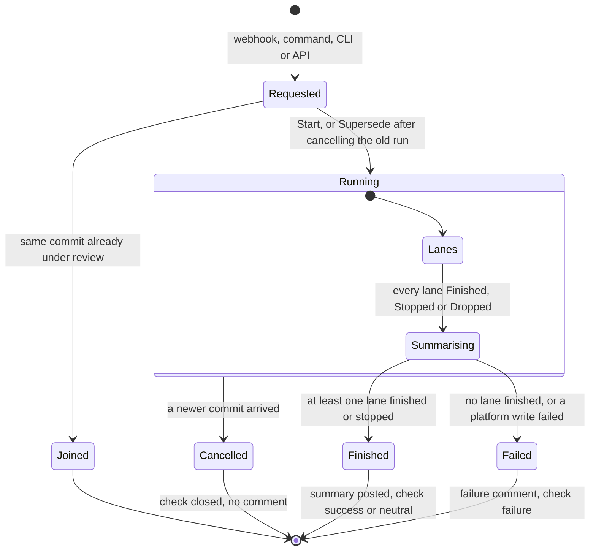
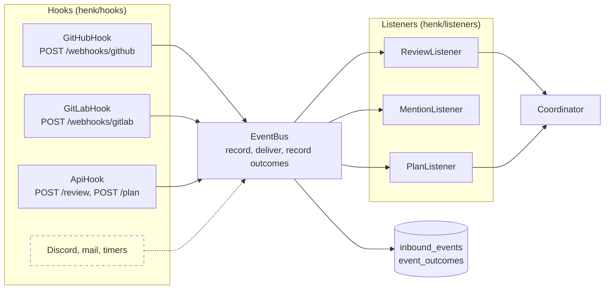
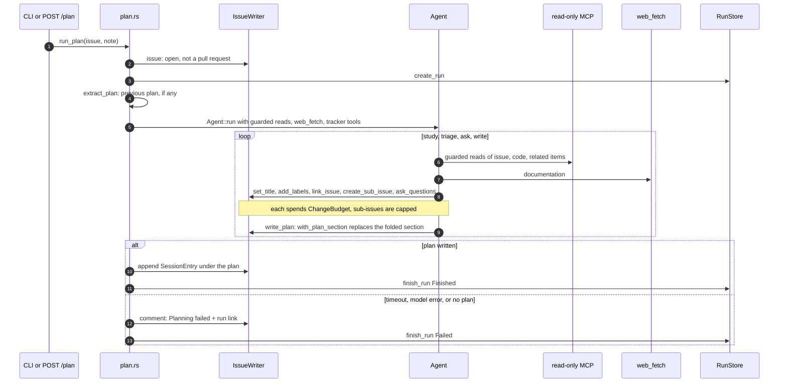
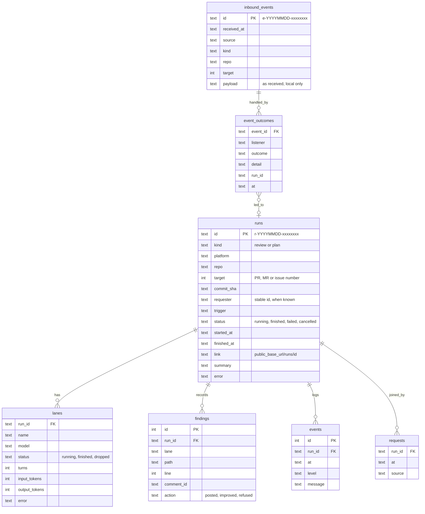
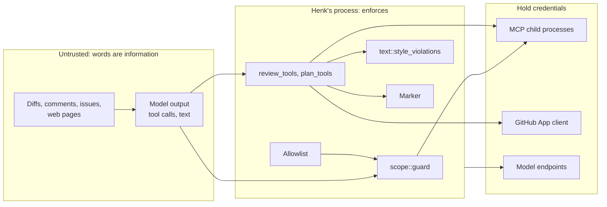
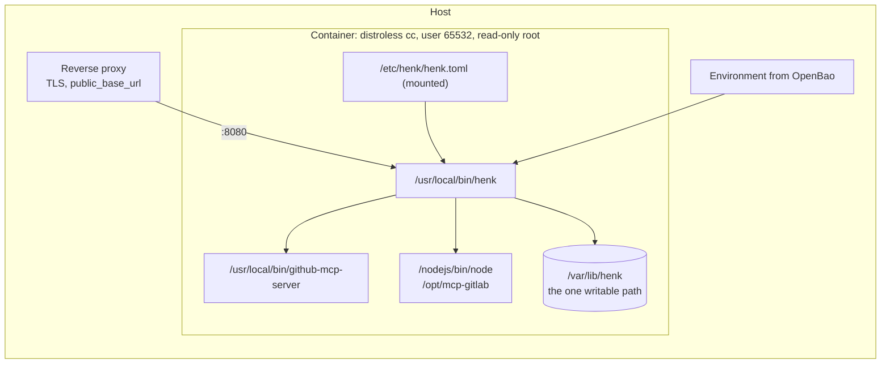

# Architecture

How Meneer Henk is built. The spec in [docs/SPEC.md](docs/SPEC.md) says what he
does and promises; this file says how the code keeps those promises. The README
says how to configure and run him. Section numbers (§3.2 and so on) refer to the
spec.

This version covers code review (§3) and issue planning (§4) on GitHub and
GitLab. Discord (§5), email (§6) and voice (§5.5) are later passes; they appear
dashed in the first diagram so the shape of the whole is visible.

The diagrams are Mermaid, which GitHub renders in place.

## 1. System context

Henk is one process that is an MCP *client*. The platforms are reached through
external MCP servers started as child processes; models are reached over HTTPS.
Nothing a model says reaches a platform without passing through Henk's own code.

What to notice: two sessions per platform. The read-only session is the only
one a model can reach, and even that only through the guard of section 4. The
write-mode session (GitLab) and the App REST client (GitHub) are driven by
Henk's code with arguments it constructs.

## 2. Crates

| Crate | Modules | Depends on |
|---|---|---|
| `henk-domain` | `identity`, `allowlist`, `review`, `finding`, `marker`, `scope`, `queue`, `plan`, `run`, `text`, `discord`, `mail` | serde, thiserror, serde_json |
| `henk-llm` | `types`, `client`, `openai`, `anthropic`, `http`, `schema`, `testing` | reqwest with rustls (ring) |
| `henk-mcp` | `session`, `config`, `names`, `testing` | rmcp 3.5 (client features only) |
| `henk-agent` | `agent`, `tool`, `mcp_tools`, `prompts` and `prompts/*.md` | domain, llm, mcp |
| `henk-session` | `lib`: `SessionSpec`, `run_session`, `platform_tools` | domain, llm, mcp, agent, store |
| `henk-events` | `event`, `github`, `gitlab`, `bus` | domain, tokio |
| `henk-platform` | `webhook`, `writer`, `issue`, `github/{app,api,writer,issues}`, `gitlab/{writer,issues}` | domain, llm, mcp, ring, hmac |
| `henk-store` | `store`, `migrations/001_initial.sql` | rusqlite (bundled) |
| `henk` | `main`, `config`, `app`, `hooks/{github,gitlab,api}`, `listeners/{filter,review,mention,plan}`, `recorder`, `review`, `review_tools`, `plan`, `plan_tools`, `web_fetch`, `coordinator`, `server`, `urls`, `doctor`, `ids` | all of the above, axum |

`henk-platform` depends on `henk-llm` for one function, `ensure_tls_provider`,
so every HTTPS client in the process shares the same rustls setup.

## 3. A review, end to end

A `synchronize` webhook from GitHub, start to finish. The GitLab path is the
same with the writer swapped (section 10 lists the differences).

Three details carry the spec's weight. The count comes from the second
`existing_findings` call, what the platform reports rather than memory, so
findings of earlier reviews whose line is still in the diff count too (§3.3).
Findings are posted inside the loop by `post_finding`, not collected until the
end (§3.2). A lane that fails comes back as `Dropped` and the review stands on
the others (§3.3). A lane that reaches its time limit comes back as `Stopped`:
what it posted stands, it posts nothing more, and the review completes.

## 4. Where a tool call goes

The most important picture in this file. A model never receives a credential
or a write tool. What it receives is a list of tool names; every call goes
through Henk's dispatcher, and every MCP call through the guard.

The guard table lives in `crates/henk-domain/src/scope.rs`. It is a constant
list per platform of read tools and the arguments each one gets pinned. A tool
that is not in the table does not exist as far as the model is concerned, and
`henk mcp probe` shows which of a server's tools the table exposes. The server
itself is also started restricted (`GITHUB_READ_ONLY=1`, `GITLAB_PERMISSION_MODE=readonly`),
so the guard is the second fence, not the only one.

## 5. Review lifecycle and overlap

The decision between Start, Join and Supersede is the pure function
`henk_domain::queue::decide`; the coordinator applies it under a lock and
cancels the superseded run's token. On GitHub, `Finished` with zero open
findings concludes the check `success`, with findings `neutral`, and only
`Failed` concludes `failure`, which is Henk's failure, not the code's (§3.3).
On GitLab the commit status is always `success` with the count in its
description, because a status must never block a pipeline (§8.2).

## 6. Hooks, events and listeners

In serve mode nothing calls an orchestrator directly. A hook turns what it
receives into an `Event` and publishes it; the bus records the event, hands it
to every listener at once, and records what each listener did. Listeners never
see each other; the one rule that used to be implicit in an if/else chain,
that a review command is a command and not a mention, is now a test.

The event model (`henk-events`): `Event { id, received_at, source, kind, payload }`,
`EventSource` (GitHub webhook with delivery id, GitLab webhook, API with
requester), `EventKind` (pull request change, comment, review requested, plan
requested, unmodelled, ignored) and `Handled` (ignored, started, joined,
superseded, greeted, failed with a reason). A webhook kind no parser models is
`Unmodelled` and still recorded, so a future listener can be written against
real recordings. Recordings never leave the service.

A session (`henk-session`) is the other abstraction: `SessionSpec` says what
varies (model, system prompt, opening messages, tools, limits) and
`run_session` does what every session shares (the lane row, the loop, the stop
mapping, the timeline line). A review is N sessions on one read-only MCP
session; a plan is one.

## 7. Planning

The plan section and the session log are a region delimited by HTML comments,
parsed and rendered by `henk_domain::plan`. `set_description` keeps that region
intact; `write_plan` keeps the session log and replaces the plan; the session
entry is appended by code after the run, never by the model.

## 8. Run records

Every comment Henk posts ends with a hidden marker
(`<!-- meneer-henk run=... model=... kind=... -->`) rendered by
`henk_domain::marker`. It is how he recognises his own words, how the writer
finds earlier summaries and findings, and how a comment links back to its run
(§8.1, §8.6).

## 9. Trust boundaries

| Invariant (§8) | Enforced by |
|---|---|
| 1. Henk never triggers himself | `listeners/filter.rs`: events from bots, from Henk's own login, or whose body carries a `Marker` are rejected before any listener acts |
| 2. Henk is advisory | No write tool can approve, merge or push; `GitLabWriter::finish_review` always sets `success`; `ReviewOutcome::check_conclusion` only fails for an incomplete review |
| 3. Words are information | Prompts say so, but the code does not rely on it: every write goes through tools that validate arguments; `web_fetch` sends nothing but the URL |
| 4. The model never holds credentials | Secrets are read from the environment by `App::build`, `RmcpSession::connect` (passed to the child only), and `GitHubAuth`; the model sees tool names |
| 5. Scope is fixed per task | `scope::guard` pins repository, pull request and commit for reviews, repository and issue for plans; `plan_tools` refuse other issues except through `link_issue` |
| 6. Every visible action is traceable | `Marker` on every comment, `RunStore` for every run and every inbound event with its outcomes, `/runs/{id}` and `/events/{id}` |
| 7. Allowlists bound the world | `Allowlist::allows` in `listeners/filter.rs`, `run_review` and `run_plan` |
| 8. Failure is visible | `report_failure` posts a failure comment and closes the check; `run_plan` posts "Planning failed"; both record the error on the run |

## 10. GitHub and GitLab differences

| Concern | GitHub | GitLab |
|---|---|---|
| Reads for models | `github-mcp-server` with `GITHUB_READ_ONLY=1` | `mcp-gitlab` in `readonly` mode |
| Writes | REST and GraphQL as the App (`github/api.rs`), because the MCP server's pending-review model is a per-user singleton and unsafe for concurrent lanes | `mcp-gitlab` in `modify` mode with a tool allow-list, driven by `gitlab/writer.rs` |
| Review started | check run `in_progress` | award emoji on the merge request |
| Finding | review comment at `commit_id`, `path`, `line`, `side` | diff thread with a `position` built from the merge request's `diff_refs` |
| Folding | GraphQL `minimizeComment` as `OUTDATED` | the earlier summary note is edited to `*Outdated.*` plus its marker |
| Review ended | check `success`, `neutral` or `failure` | commit status always `success`, count in the description |
| Thread state | GraphQL review threads: `isResolved`, who replied | `mr_discussions`: `resolved`, who replied |
| Mention reply | reply in the review thread, or a conversation comment | reply in the discussion, or a note |

## 11. Configuration and secrets

`henk.toml` holds ids, the allowlist, models, lanes and the MCP server commands.
It never holds a secret; every secret is named by the environment variable that
carries it, and the deployment fills those variables from OpenBao.

| Variable | Read by | Reaches |
|---|---|---|
| `[models.*].api_key_env` | `App::build` | the model client, as a bearer token or `x-api-key` |
| `GITHUB_APP_PRIVATE_KEY_PATH` | `App::build` and, by name, the GitHub MCP child | `AppCredentials` (RS256 on ring) and the child's own token minting |
| `GITLAB_PERSONAL_ACCESS_TOKEN` | passed by name to both GitLab MCP children | the children only |
| `HENK_GITHUB_WEBHOOK_SECRET`, `HENK_GITLAB_WEBHOOK_TOKEN` | `server::router` | signature and token checks |
| `HENK_API_TOKEN` | `server::router` | `POST /review` and `POST /plan` |

Child processes get a cleared environment plus a short inherited list (`PATH`,
`HOME`, locale, temp) and the variables their configuration names
(`RmcpSession::connect`). A token meant for one server never reaches another.

## 12. Deployment

The image is built by the `Dockerfile` with a cross-compiling Rust stage, so an
arm64 image comes off an amd64 builder. `henk doctor` runs inside the container
and starts both child servers, which is the quickest way to find a missing
variable before the first webhook arrives.

## 13. Decisions and deviations

- **rmcp with a small loop of our own, not goose.** The published goose crates
  are alphas without MCP client wiring, the crate with the Agent is unpublished
  and reads global configuration, and its MCP layer is rmcp anyway. Owning the
  dispatcher is what makes §8.4 and §8.5 properties of code.
- **Hand-written model adapters.** Two wire formats cover the proxy, Anthropic,
  OpenAI and Ollama in about a thousand lines, including the details an MCP
  host needs that the libraries lack: error flags on tool results, tool-name
  mapping, untouched schemas, opaque thinking blocks echoed back.
- **GitHub writes over REST.** See section 10.
- **GitLab's built-in MCP server is not used.** It is OAuth-only in its
  documentation and lacks commit statuses and award emoji; `mcp-gitlab` takes a
  personal access token and covers everything needed.
- **Provisional answers to the spec's open questions** are listed at the end of
  the README and move into `docs/SPEC.md` once confirmed.
